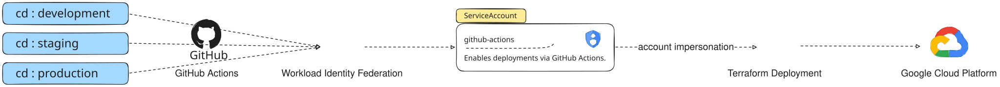
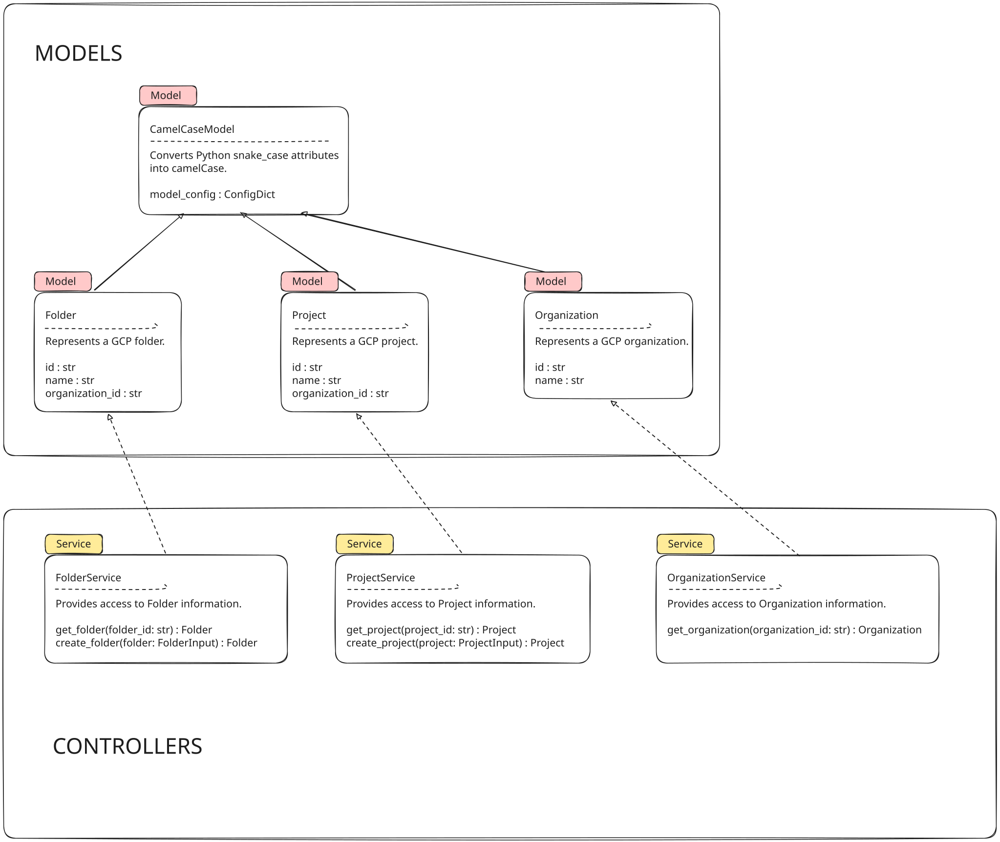

# google

**Command Line Interface (CLI)** to bootstrap development on _Google Cloud Platform (GCP)_.

## Environments

The project is deployed across multiple *environments*, each of which has its own Terraform configuration.



| Environment | Description |
| ----------- | ----------------------------------------------------------------- |
| _development_ | Development environment for testing and experimentation.          |
| _staging_   | Staging environment for pre-production testing.                   |
| _production_| Production environment for live deployment.                       |

*Terraform* configurations are located in the `terraform/environments` directory.

### Environment Variables

The project relies on *environment variables* to execute. There are no default values, so be sure these values are defined wherever they are relevant.

```sh
# Project
GCP_PROJECT=gcp-development-12345
GCP_ORGANIZATION=12345678901
GITHUB_ORG=bellanov
GITHUB_REPO=google

# Workload Identity Federation (WIF)
PROJECT_NUMBER=$(gcloud projects describe $GCP_PROJECT --format=value\(projectNumber\))
WORKLOAD_IDENTITY_POOL="github"
SERVICE_ACCOUNT="github-actions"
SERVICE_ACCOUNT_EMAIL="github-actions@${GCP_PROJECT}.iam.gserviceaccount.com"
WIF_PRINCIPAL="principalSet://iam.googleapis.com/projects/${PROJECT_NUMBER}/locations/global/workloadIdentityPools/${WORKLOAD_IDENTITY_POOL}/*"
REPO_PRINCIPAL="principalSet://iam.googleapis.com/projects/${PROJECT_NUMBER}/locations/global/workloadIdentityPools/${WORKLOAD_IDENTITY_POOL}/attribute.repository/${GITHUB_REPO}"
```

### Workload Identity Federation

The project uses *[Direct Workload Identity Federation](https://github.com/google-github-actions/auth?tab=readme-ov-file#preferred-direct-workload-identity-federation)* to manage identities and access across different environments.

In this setup, the Workload Identity Pool has direct IAM permissions on Google Cloud resources; there are no intermediate service accounts or keys. This is preferred since it directly authenticates GitHub Actions to Google Cloud without a proxy resource. However, not all Google Cloud resources support principalSet identities, and the resulting token has a maximum lifetime of 10 minutes. Please see the documentation for your Google Cloud service for more information.


| Workflow | Description |
| -------- | ----------------------------------------------------------------- |
| _cli-ci-\<environment\>_     | Continuous Integration workflow for testing and validating the `cli`.  |
| _cd-\<environment\>_     | Continuous Deployment workflow for *Terraform* deployments.  |

## Architecture

The project _architecture_ is summarized below.



## Project Structure

The project _structure_ is summarized below.

```sh
gcp
├── .github
│   └── workflows
├── diagrams
├── docs
├── cli
│   └── domain
│       ├── models
│   └──  services
│   └──  tests
│       ├── models
│       └── services
├── terraform
│   └── environments
│       ├── development
│       ├── production
│       └── staging

```

| Environment | Description                                                       |
| ----------- | ----------------------------------------------------------------- |
| _.github_   | Contains GitHub **workflows** for CI/CD.                          |
| _diagrams_  | Contains project architecture **diagrams**.                       |
| _docs_      | Contains project **documentation**.                               |
| _cli_       | Contains project **source code** for GCP tooling.                 |
| _terraform_ | Contains **Terraform configurations** for different environments. |


